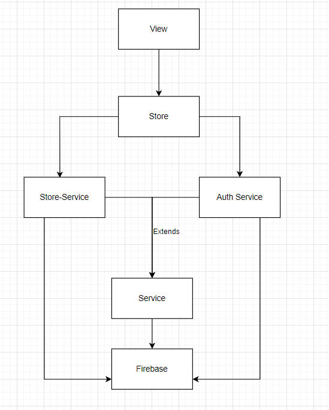

## Hướng dẫn download code và chạy project

- Yêu cầu đã cài node và git
- Bước 1: Gõ lệnh "git clone https://github.com/NguyenHongThaiii/budget-react.git"
- Bước 2: Mở terminal với vị trí project và gõ lệnh "yarn" hoặc "npm i" nếu sử dụng npm
- Bước 3: Gõ lệnh "yarn dev" hoặc "npm run dev" nếu sử dụng npm

## CÁC TÍNH NĂNG ĐƯỢC UPDATE

1. Áp dụng context vào mobx (nhưng vẫn sử dụng chung 1 store vì thấy auth-store không cần thiết vì auth không có nhiều data)
2. Tạo thêm module serivce để tách logic ở store ra (store-service + auth-service + firebase-service)
3. Tạo thêm folder constant để lưu những giá trị hằng
4. Sửa lại slide show category dynamic không còn static

## Propose architecture: layer? service? data? (Design pattern)

1. Layer

- 

2. Data

- Sử dụng firebase store
  
- https://dbdiagram.io/d/64c230e502bd1c4a5ec8ef02

3. Propose scope: stack (Technology)
   - Language: Reactjs
   - DBMS: Firebase-firestore
   - State management: React-context + mobx
   - UI library: Material ui
   - Tools build: Vitejs
   - Flow:
     - Có tài khoản:
       
     - Chua có tài khoản:
       
